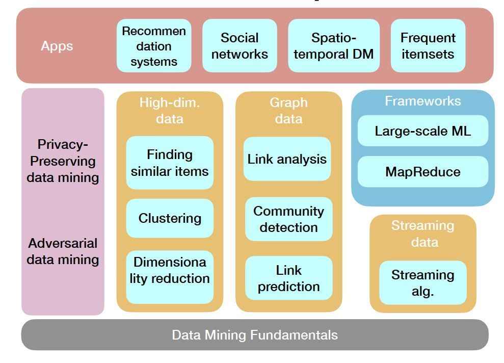

# SJTU EE359 数据挖掘技术
* 参考教材

    * [数据挖掘概念与技术（中文第三版）](./教材)
    * [Probability and Statistics EBook](https://wiki.socr.umich.edu/index.php/Probability_and_statistics_EBook)
    * [Mining of Massive Datasets](http://www.mmds.org/#book)

* 课程框架  
  
  

* 课程内容

    * [Introduction](./课件/Introduction)
    * [High-Dimension Data](./课件/High-dim-data)
    * [Graph Data](./课件/Graph-data) 
    * [Streaming Data](./课件/Streamingalg) 
    * [Frameworks](./课件/Frameworks)
    * [Privacy and Security](./课件/PrivacyandSecurity)
    * [Apps](./课件/Apps)
    

* 实验
  1. [Clustering (K-means)](./Lab/lab1)
  2. [Community Detection (Louvain)](./Lab/lab2)
  3. [Link Prediction (Network embedding)](./Lab/lab3)
  4. [Streaming Algorithm (DGIM, Bloom filter, Count-Min sketch)](./Lab/lab4)

* 项目  
  
    [Movie Recommendation System](./Project)