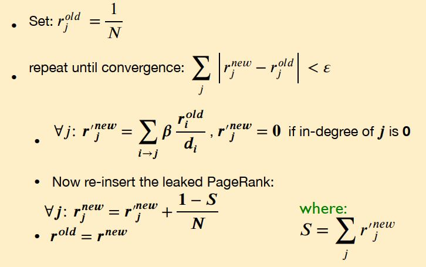
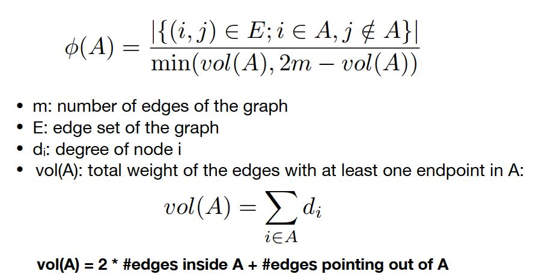
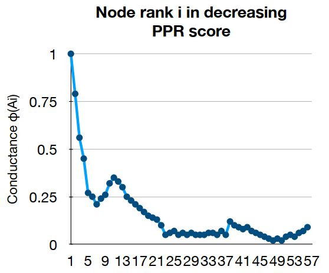
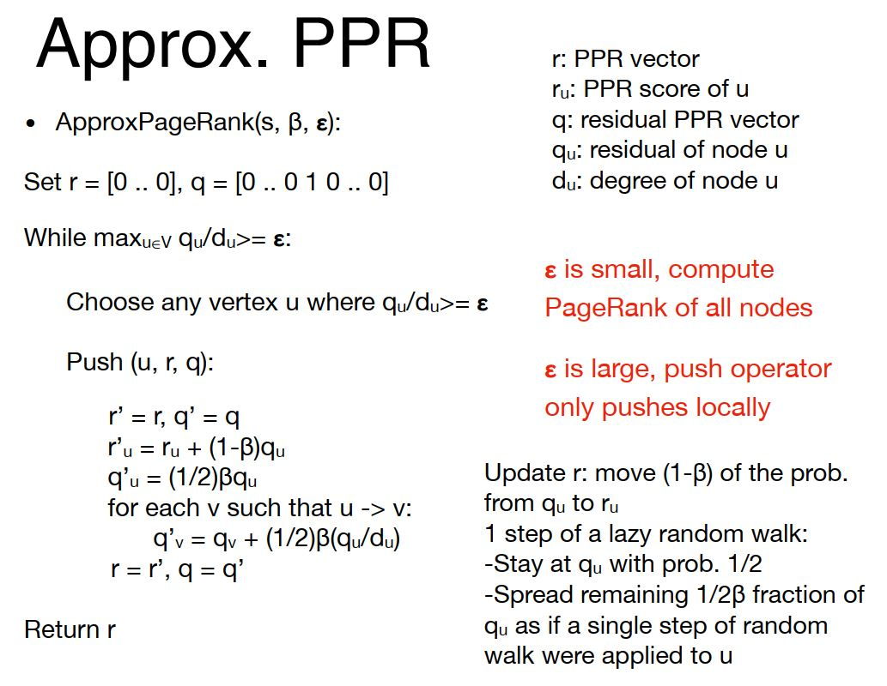
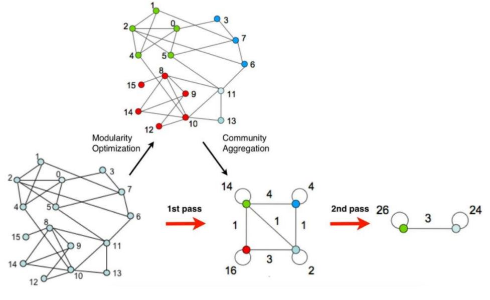
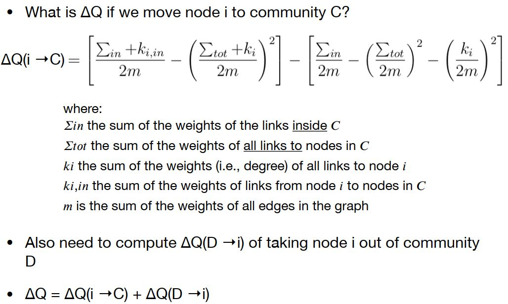
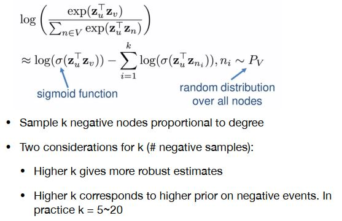
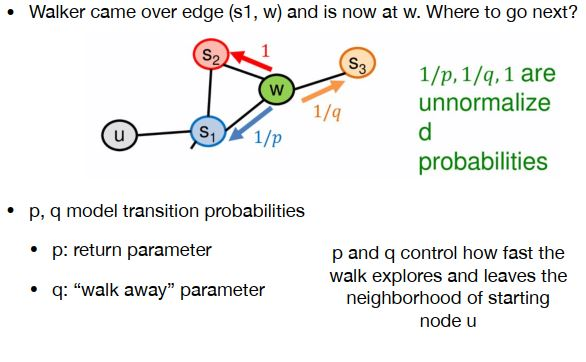

# Link Analysis
* Page Rank

    Given a web graph with n nodes, where the nodes are pages and edges are hyperlinks  
    * idea: Links as votes

        Page is more important if it has more links  
        Links from important pages count more
    * Flow formulation 

        If page j with importance $r_j$ has n out-links, each link gets $r_j$ / n votes  
        Page j’s own importance is the sum of the votes on its in-links  
        Define a “rank” $r_j$ for page j: $r_j=\sum_{i\rightarrow j}\frac{r_i}{d_i}$,  where $d_i$ is out-degrees of i

    * Matrix formulation

        * Stochastic adjacency matrix **M**

            If $i\rightarrow j$, $M_{ji}=1/d_i$; else $M_{ji}=0$  
            M  is a column stochastic matrix. Columns sum to 1
        * Rank vector **r**: vector with an entry per page

            $r_i$ is the importance score of page i, $\sum_ir_i=1$
        * Flow equation: $r = M \cdot r$
    * Power Iteration Method

        1. Suppose there are N web pages
        2. Initialize: $r^{(0)} = [1/N,...,1/N]^T$
        3. Iterate: $r^{(t+1)} = M\cdot r^{(t)}$
        4. Stop when $|r^{(t+1)} – r^{(t)}|_1 < \epsilon$

        This method works because the result r approaches the principal eigenvector of matrix M
    * Problems
      * dead ends: some pages have no outlinks  
        Such pages cause importance to leak out
      * spider traps: all out-links are within the group  
        Eventually spider traps absorb all importance
    * Solution: Teleports

        At each time step, the random surfer has two options
        * With prob. $\beta$, follow a link at random
        * With prob. $1-\beta$, jump to some random page
        * Common values for $\beta$ are in the range 0.8 to 0.9
        * For dead end i, it will jump to a random node with probability $1/d_i$
    * Teleports formulation
        * PageRank equation: $r_j=\sum_{i\rightarrow j}\beta\frac{r_i}{d_i}+(1-\beta)\frac{1}{N}$
        * Google Matrix A: $A=\beta M+(1-\beta)[\frac{1}{N}]_{NxN}$
        * Iteration: $r = A\cdot r$
    * Complete Algorithm

        
    * Lower memory complexity
        * Encode sparse matrix using only nonzero entries, from matrix to dictionary
        * Break rank vector r into k blocks that fit in memory
        * break M into stripes such that each stripe contains only destination nodes in the corresponding block
  
* problem one in PageRank

    Measures generic popularity of a page  
    Solution: Topic-Specific PageRank

* Problems two in PageRank

    Uses a single measure of importance  
    Solution: Hubs-and-Authorities
* Problems three in PageRank

    Susceptible to Link spam  
    Solution: TrustRank

# Community Detection
Goal: find densely linked clusters in graph
* PageRank based Clustering

    * Algorithm outline

        1. Pick a seed node s of interest
        2. Run Personalized PageRank with teleport set={s}
        3. Sort the nodes by the decreasing PPR score
        4. Sweep over the nodes and find good clusters
    * Graph partition criteria: Conductance

        Why use this criteria? Produces more balanced partitions
        
    * Sweep process

        * Sort nodes in decreasing PPR score r1 > r2 > … > rn
        * For each i compute $\phi(A_i = {r_1,...,r_i})$
        * **Local minima** of $\phi(A_i)$ correspond to good clusters

        
        * To compute $\phi(A_{i+1}) = Cut(A_{i+1})/Vol(A_{i+1})$  
            we can use the result from last loop  
            $Vol(A_{i+1})=Vol(A_{i})+d_{i+1}$,  where $d_{i+1}$ is out-degrees of node  
            $Cut(A_{i+1})=VCut(A_{i})+d_{i+1}-2\#(edges\ of\ i+1\ to A_i)$
    * Calculation of Personalized PageRank

        Obviously, Power method won’t work since each single iteration accesses all nodes of the graph, it's time-consuming.  
        Instead, we use Approximate PageRank [Andersen, Chung, Lang,’ 07]  
        
    
* Modularity Maximization

    Louvain Method: Greedy alg. for community detection with O(nlogn) run time  
    Supports weighted graphs  
    Provides hierarchical partitions  
    Widely utilized to study large networks because:  
    fast, rapid convergence properties and high modularity output
    * Louvain Alg. Outline
        1. Phase 1: Modularity is optimized by allowing only local changes of communities
        2. Phase 2: The identified communities are aggregated in order to build a new network of communities
        3. Go to Phase 1 until no increase of modularity is possible
    * Overall View

        

    * Phase 1: Partition

        * Put each node in a graph into a distinct community (one node per community)
        * For each node i
          * Compute the modularity gain (ΔQ) when putting node i from its current community into the community of some neighbour j of i
          * Move i to a community that yields the largest modularity gain
        * The loop runs until no movement yields a gain  
            It's a local maxima of the modularity, no individual move can improve the modularity
        * Calculation of modularity gain
            

    
    * Phase 2: Restructuring

        * The partitions obtained in the 1st phase are contracted into supernodes, create weighted network as follows
        * Super-nodes are connected if there is at least one edge between nodes of the corresponding communities
        * The weight of the edge between the two super-nodes is the sum of the weights from all edges between their corresponding partitions
        * The loop runs until the community configuration does not change anymore

    
# Link Prediction

* Problem formulation
  * Given: graph G, vertex set V, edge set E
  * Target: encode nodes into embedding matrix such that the similarity between node vectors appoches to the similaity in graph network.
  * Three steps
    1. Define an encoder(a mapping from nodes to vectors)
    2. Define a node similarity function (i.e., a measure of similarity in the original network)
    3. Optimize the parameters of the encoder so that $similarity(u,v) \approx Z_v^T Z_u$
 * Two components
   1. Encoder: maps each node to a low-dimensional vector  
      Here we use an embedding matrix as encoder. we just perform an embedding-lookup to get the corresponding vector for given node index.

   2. Similarity function  
    The similarity between node vectors is measured by dot product.  
    The similarity between nodes in graph can be measured by connection, shared neighbor, structural role and so on

* Deep Walk 
  * Under particular walking policy, estimate the probability from $v_i$ to $v_j$. 
  * The more similar between these two nodes, the more likely they will appear in the same random walk
  * Random Walk Optimization (O(|V|^2))
    1. Run short fixed-length random walks starting from each node on the graph using some strategy R
    2. For each node u collect NR(u), the multiset of nodes visited on random walks starting from u
    3. Maximize the log-likelihood of NR(u) given node u.

  * Approximate: negative sampling
    * random sampling k nodes in likelihood instead of sampling all nodes in graph  
    

* node2vec (a biased random walk strategy)
  * Develop biased 2nd order random walk R to generate network neighborhood
  * Combine bfs-like walk and dfs-like walk.   
  
    

 