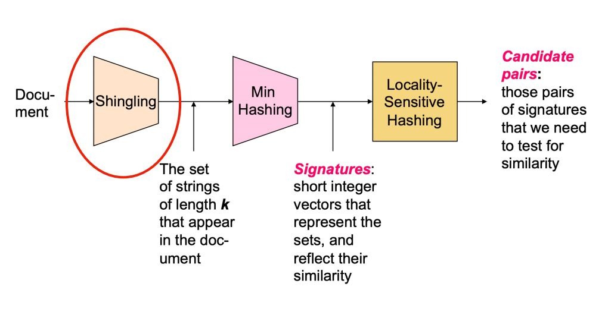
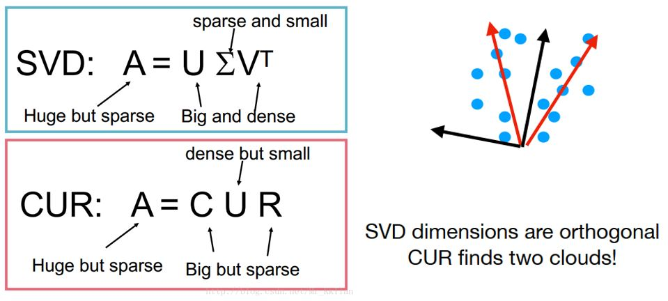

# Finding similar items(documents)
* Goal: Given a large number (N in the millions or billions) of documents,
find *near duplicate* pairs
* Problems
  * Many small pieces of one document can appear out of order in another
  * Too many documents to compare all pairs
  * Documents are so large or so many that they cannot fit in main memory
* Solution
  1. **Shingling** : convert documents into sets 
  2. **Min-Hashing** : Convert large sets to short signatures, while preserving similarity
  3. **Locality-Sensitive Hashing** : hash to find candidate pairs of
similarity >= s
   

* Detail
  * Shingling  
    * Defination: A k-shingle (or k-gram) for a document is a sequence of k tokens that appears in the doc
    * Compression: Construct the set of 9-shingles for a document and map each of those 9-shingles to a bucket number in [0, 2^32-1]  
    Then each shingle is represented by 4 bytes instead of 9
    * Build: Define a shingle to be a stop word(and, you, to, the,...) followed by the next two words. 

  * Min Hashing
    * Background:  
    *Boolean Matrix*: rows = singles, columns = documents (sparse matrix)   
        Matrix[i][j]=1 means shingle i is in document j  
    *Motivation*: The Boolean matrix is large  
    *Method*:  **hash** each column C to a small signature h(C) s.t. h(C) is small and sim(C1, C2) is the same as the `similarity’ of signatures h(C1) and h(C2)  
    *Limitation*: The hash function depends on the similarity metric, not all similarity metrics have a suitable hash function
    * Procedure(For Jaccard Similarity):  
      1. Define hash function $h_{\pi}(C)$ = the index of the first (in the permuted order $\pi$) row in which column C has value 1
      2. Use several (e.g., 100) independent hash functions (random permutations in row for Boolean Matrix) to create a signature matrix
      3. Now we compress the boolean matrix with smaller # of rows. The Jaccard similarity between two documents is the (# of rows with same value/total # of rows) between two corresponding columns in signature matrix. 
  * Locality-Sensitive Hashing
    * Goal: From compaing each pair to focusing on pairs that are likely to be similar
    * Methods:
      1. Divide matrix M into b bands of r rows (br = n and threshold $\approx$ (1/b)^(1/r))
      2. For each band, hash its portion of each column to a hash table with k buckets
      3. Candidate column pairs are those that hash to the same bucket for >= 1 band
   
# Clustering(Euclidean space)
 * Hierarchical Clustering  
    * Key operation: Repeatedly combine two nearest clusters
    * Naive Implementation: At each step, compute pairwise distances between all pairs of clusters, then merge 
    * Use priority queue: O(N^3) ---> O(N^2logN)
 * K-means Clustering 
    * Procedure  
      1. Pick k, the number of clusters
      2. Initialize clusters by picking one point per cluster
      3. For each point, place it in the cluster whose current centroid it is nearest
      4. After all points are assigned, update the locations of centroids of the k clusters
      5. Reassign all points to their closest centroid
      6. repeat d and e until convergence
   * Details  
     * Convergence: Points don’t move between clusters and centroids stabilize
     * Complexity: Each round is O(kN) for N points, k clusters
     * Choice of k: Try different k, calculate average distance to centroid. Average falls rapidly until right k, then changes little  
     * Choice of Initial points: Random, Sampling, Pick “dispersed” set of points and so on

 * EM Algorithm + GMM  
    [Here for detail](EMAlgorithm.md)

# Dimensionality Reduction

  * why reduce dimension

    Discover hidden correlations/topics  
    Remove redundant and noisy features  
    Interpretation and visualization  
    Easier storage and processing of the data
  * Single Value Decomposition

    $A=U\Sigma V^T$
    * A: Input matrix m x n matrix (e.g., m documents, n terms)
    * U: Left singular vectors, m x r matrix, $U^TU=I$
    * $\Sigma$: Singular values, r x r diagonal matrix (r is rank of matrix A)
    * V: Right singular vectors, n x r matrix, $V^TV=I$
    * SVD-Dimensionality Reduction:

      Set the smallest singular values to zero!  
      Rule-of-a thumb: keep 80-90% of *energy* = $\sum_i\sigma_i^2$
    * How to compute SVD(three matries)

      * Calculation of U

        $(AA^T)u_i=\lambda_iu_i$ Put all eigenvectors together we get the m x m matrix U 

      * Calculation of V

        $(A^TA)v_i=\lambda_iv_i$ Put all eigenvectors together we get the n x n matrix V 
      
      * Calculation of $\Sigma$

        $A=U\Sigma V^T\Rightarrow AV=U\Sigma V^TV=U\Sigma \Rightarrow \sigma_i = Av_i/u_i$

        Or we can use another method  
        $A^TA=V\Sigma U^T U\Sigma V^T = V\Sigma^2V^T \Rightarrow \sigma_i =\sqrt{\lambda_i}$
    * Pros and Cons

      * Pros: Optimal low-rank approximation in terms of Frobenius norm
      * Cons: 
        1. Interpretability problem(A singular vector specifies a linear combination of all input columns or rows)  
        2. Lack of sparsity(Singular vectors are dense)
  
  * CUR Decomposition

    $A=CUR$
    * A: Input matrix m x n matrix (e.g., m documents, n terms)
    * C: Randomly chosen columns of A, m x r matrix
    * U: r x r matrix (tricky)
    * R: Randomly chosen rows of A, r x n matrix
  
    Choice of rows and columns
    * the number of rows(columns) is chosen as you like
    * We choose rows with probability $p_i=\sum_{j}a_{ij}^2/\sum_{ij}a_{ij}^2$
    * We choose columns with probability $q_j=\sum_{i}a_{ij}^2/\sum_{ij}a_{ij}^2$
    * For selected rows(columns), divide elements by $\sqrt{rp_i}$($\sqrt{rq_j}$)

    Calculation of matrix U

    1. start with W = intersection of sampled columns C and rows R
    2. compute the SVD of W as $X\Sigma Y^T$
    3. then U = $Y\Sigma^{+}X^T$, where $\Sigma^+$ is reciprocals of non-zero singular values ($\Sigma^+_{ii} = 1/\Sigma_{ii}$)

    
    * Pros and Cons

      * Pros: Easy interpretation, Sparse basis(Basis vectors are actual columns and rows)
      * Cons: Duplicate columns and rows(Columns of large norms will be sampled many times)
